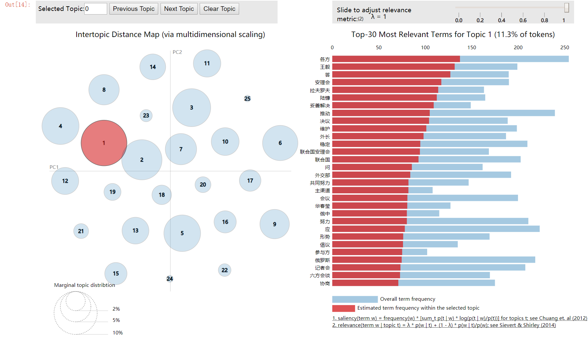

# README

  

## Intuition

- 此积木是基于Cemoody的[lda2vec](https://github.com/cemoody/lda2vec) 的项目模型测试，模型训练代码采用[**lda2vec-pytorch**](https://github.com/TropComplique/lda2vec-pytorch) 的方法，工程搭建思路基于[cbx123](https://github.com/cbxs123)的[基于主题表示和对齐的观点挖掘平台](https://github.com/cbxs123/Topic-Visualization) 
- 仅作学习用途


## Note

- lda2vec在语料较大的时候训练起来是很麻烦的，需要相当长的时间消耗。我曾用，维基百科的中文语料，训练了2.5天之久。当然本rep是一种中文语料的lda2vec的处理思路。我数据处理方面采用[jieba](https://github.com/fxsjy/jieba) 也可以用HANnlp,StanfordNlp等，因为只追求模型的测试可用性，没有追求效果的表达性，很多地方需要后期的修补。
- [ ] 暂时没有加预训练词向量的用法（可参考最新的[lda2vec-tf](https://github.com/nateraw/Lda2vec-Tensorflow) 或者是原作者的方法）


## Usage

- requirements 提供了数据处理所需的环境
- 模型训练我是在GCP-Deeplearning-vm 环境下 的pre-install的pytorch 下的环境，并且有NVIDIA-cuda-enable
- 建议对工程建立**虚拟环境**再进行相关的数据处理


## 组件

```
.
├── Debug_log.md
├── Explore.ipynb
├── Explore_pyLDAvis.ipynb
├── README.md
├── data_prepare.py
├── explore_check.py
├── explore_pyLDAvis.py
├── prepare_pyLDAvis.py
├── requirements.txt
├── stopwords.txt
├── topics.py
├── train.py
├── utils
│   ├── __init__.py
│   ├── alias_multinomial.py
│   ├── get_windows.py
│   ├── lda2vec_loss.py
│   ├── preprocess.py
│   └── training.py
└── xml2csv.py
```

### 具体说明

- 模型测试数据来源[cbxs123]([https://github.com/cbxs123/news-comment-spider/tree/master/0-data/%E5%8F%8C%E8%AF%AD%E6%96%B0%E9%97%BB%E9%9B%86](https://github.com/cbxs123/news-comment-spider/tree/master/0-data/双语新闻集))
  - **注意** ：这份数据仅仅用来测试模型的可行性
  - 数据存在较多问题，例如政治新闻数据常常处理例如吴亦凡等娱乐人物相关新闻，甚至出现毫无相关的文本内容
  - **解决方案** ：自行爬取所需的文本，进行先关数据分析任务工程的构建，模型可以参考本方案(tips：使用mongodb进行先关的文本数据存储）
  - **注：**仅作学习使用
- 数据处理方案
  - xml2csv.py完成数据格式csv的转化
- 运行explore_check.py完成模型训练的数据准备。
- 运行train.py完成模型的训练并存储训练的结果
- 运行prepare_pyLDAvis.py和explore_pyLDAvis.py完成对pyLDAvis的可视化的数据准备(**后期跟新删除**)。

## 重点的基础debug修改

- 模型训练的pytorch版本更新很多关于torch会有更新的操作，eg在training中item替代data，utils中的alias_multinomial.py做伯努利的方案的时候参数并没有像预处理在01之间。
- ==待更新==


## 主题演化的可视化效果

- 详细见[Topic_Evolution_vis.ipynb](https://nbviewer.jupyter.org/github/JA1lE1/Topic_Evolution_developing/blob/master/Topic_Evolution_vis.ipynb)

### pyLDAvis 效果




## 参考

- [lda2vec-paper- Mixing Dirichlet Topic Models and Word Embeddings to Make lda2vec](https://link.zhihu.com/?target=https%3A//arxiv.org/abs/1605.02019)
- [作者本人的post](https://multithreaded.stitchfix.com/blog/2016/05/27/lda2vec/)